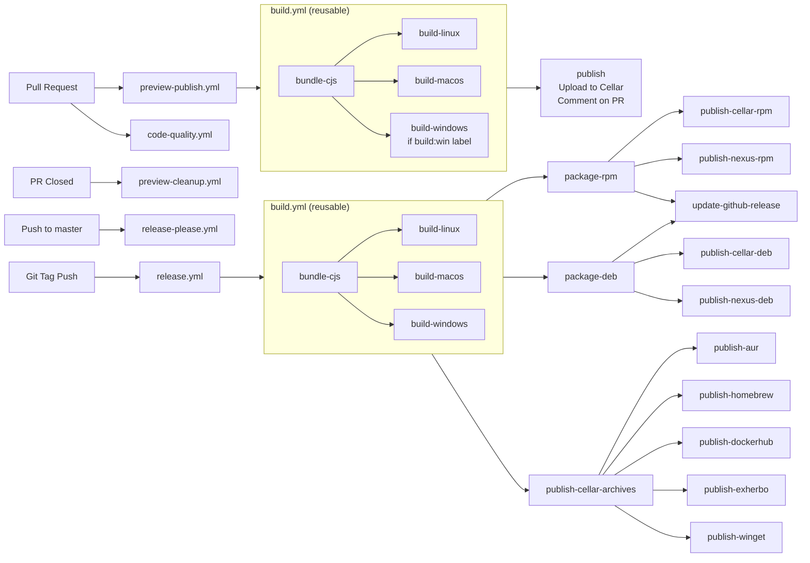

# Contributing to clever-tools

Welcome to the clever-tools project! We're happy you're interested in contributing. This guide will help you get started with development and explain our contribution process.

## Prerequisites & Setup

### Requirements

- Node.js 22 or higher (includes npm)
- A Clever Cloud account (needed to test CLI commands)
- Git
- System tools for local builds: `tar`, `zip` (usually pre-installed)

### Getting Started

1. **Fork and clone the repository**
   ```bash
   git clone https://github.com/YOUR_USERNAME/clever-tools.git
   cd clever-tools
   ```

2. **Install dependencies**
   ```bash
   npm install
   ```

3. **Set up local development**
   
   To use your local development version anywhere on your system, create an alias:
   ```bash
   # Add to your .bashrc, .zshrc, or equivalent
   alias cleverr='node /path/to/clever-tools/bin/clever.js'
   ```
   
   Some developers use `cleverr` (with two Rs), others prefer `clever-local` or similar. Choose what works for you!

4. **Configure Git hooks** (recommended)
   
   To ensure your commits follow our conventions:
   ```bash
   git config core.hooksPath '.githooks'
   ```

## Development Workflow

### Before you start

**Always create an issue before starting work on a PR.** This helps us:
- Discuss the feature/fix before implementation
- Avoid duplicate work
- Ensure the change aligns with project goals

### Branch Strategy

- **Main branch**: `master` (protected)
- **Feature branches**: Create from `master` with descriptive names

### Running and Debugging

- Run commands locally: `node bin/clever.js [command]` (or with the alias)
- Enable verbose mode: Add `-v` flag to any command for detailed output
- Use Node.js remote debugger for complex debugging scenarios

### Dependency Management

We maintain a conservative approach to dependencies:
- Only add dependencies when absolutely necessary
- Consider bundle size and maintenance burden
- Discuss new dependencies in your issue/PR

### API Integration

All communication with Clever Cloud's platform uses the `@clevercloud/client` library:
- Handles authentication and API requests
- Provides typed interfaces for all API endpoints
- Ensures consistent error handling across commands

## Project Structure

Understanding the codebase structure will help you navigate and contribute effectively:

- **`bin/clever.js`** - Main entry point for the CLI
- **`src/commands/`** - All CLI commands are defined here
- **`src/`** - Core libraries and utilities
- **`src/lib/`** - Additional utility libraries
- **`src/models/`** - Business logic and API interactions (a bit of a mixed bag)
- **`scripts/`** - Build and CI scripts (TypeScript with JSDoc enforced)

## Development Standards

### Code Quality

We use modern tooling to maintain code quality. These standards are automatically enforced on every pull request via our GitHub Actions workflow:

#### ESLint

Our ESLint setup uses flat config with recommended rules for JavaScript, imports, and Node.js:

```bash
# Check for linting errors
npm run lint

# Auto-fix fixable issues
npm run lint:fix

# Run all quality checks and try to auto-fix them
npm run validate
npm run fix-all
```

#### Prettier

For consistent code formatting:

```bash
# Format all files
npm run format

# Check formatting without changing files
npm run format:check
```

#### TypeScript

Currently enforced only in the `scripts/` directory (will expand to `src/` in the future):

```bash
# Type check
npm run typecheck
```

We use TypeScript through JSDoc comments for type safety without transpilation.

### Commit Guidelines

We follow [Conventional Commits](https://www.conventionalcommits.org) for automated changelog generation.

#### Format

```
<type>(<scope>): <subject>

<body>

<footer>
```

#### Types

- `feat:` - New features (appears in changelog as "🚀 Features")
- `fix:` - Bug fixes (appears in changelog as "🐛 Bug Fixes")
- `perf:` - Performance improvements (appears in changelog as "💪 Performance")
- `docs:` - Documentation changes
- `style:` - Code style changes (formatting, missing semicolons, etc.)
- `refactor:` - Code changes that neither fix bugs nor add features
- `test:` - Test additions or changes
- `chore:` - Maintenance tasks
- `build:` - Build system changes
- `ci:` - CI/CD changes

#### Scope

The scope should be the command name affected (e.g., `feat(env): add JSON output format`).

For changes affecting multiple commands:
- Split into multiple commits when possible
- Omit scope and explain in the commit body
- Use [release-please's multi-fix syntax](https://github.com/googleapis/release-please#what-if-my-pr-contains-multiple-fixes-or-features) for complex cases

#### Important Notes

- Only `feat`, `fix`, and `perf` commits appear in the changelog
- Git hooks will validate your commit format
- Invalid formats won't generate changelog entries

## Pull Request Process

### 1. Before Creating a PR

- Ensure an issue exists for your change
- Run all quality checks locally (these will also be automatically validated on your PR):
  ```bash
  npm run lint
  npm run format:check
  npm run typecheck
  ```
- Test your changes thoroughly
- Ensure your branch is rebased on the latest `master` and contains no fixup/squash commits

### 2. Creating Your PR

- Reference the issue in your PR description
- Provide clear description of changes
- Include testing instructions if applicable
- Mark as draft if work is in progress

### 3. Preview Builds

Every PR automatically gets preview builds for testing:

- **Automatic**: Linux and macOS builds for all PRs (except docs-only changes)
- **Windows**: Add the `build:win` label to include Windows builds
- **Download links**: Posted as comments on your PR
- **Cleanup**: Preview builds are removed when PR is closed

### Local Preview Management

You can manage preview builds locally using the `scripts/preview.js` script:

```bash
# Build a preview and install it locally
scripts/preview.js build [branch-name]

# Publish a built preview to remote storage
scripts/preview.js publish [branch-name]

# List and update remote previews (with filtering support)
scripts/preview.js update [filter]

# Delete a preview from remote storage and locally
scripts/preview.js delete [branch-name]

# Generate PR comment with download links
scripts/preview.js pr-comment [branch-name]
```

The script provides terminal-based preview listing and management with download progress reporting. For publish/delete operations, you'll need Cellar credentials:

```bash
export CC_CLEVER_TOOLS_PREVIEWS_CELLAR_BUCKET="your-bucket"
export CC_CLEVER_TOOLS_PREVIEWS_CELLAR_KEY_ID="your-key-id"
export CC_CLEVER_TOOLS_PREVIEWS_CELLAR_SECRET_KEY="your-secret-key"
```

### 4. Review Process

- PRs are reviewed by the Clever Cloud team
- Keep your branch up to date with `master`
- Be patient - we aim for thorough reviews

## CI/CD & Release Process

### Overview

Our CI/CD pipeline ensures quality and automates releases:

1. **Pull Requests** → Code quality validation and preview builds for testing
2. **Merge to master** → Release-please creates/updates release PR
3. **Release PR merged** → Automated release to all distribution channels

### Simplified Workflow

- Code quality validation on every PR (commit format, linting, formatting, type checking)
- Preview builds on every PR
- Conventional commits drive changelog generation
- Release-please manages versioning
- Automated publishing to multiple platforms:
  - **npm**: Published on npmjs.org
  - **GitHub Releases**: Binary archives and release notes
  - **Docker Hub**: Official Docker images
  - **Cellar**: Clever Cloud's object storage for direct downloads
  - **Nexus**: RPM and DEB packages for Linux distributions
  - **AUR**: Arch Linux User Repository
  - **Homebrew**: macOS package manager
  - **Exherbo**: Linux distribution packages
  - **WinGet**: Windows Package Manager

Key workflows:
- **code-quality.yml** - Validates commit format, code standards, and branch status on PRs
- **build.yml** - Reusable workflow creating cross-platform binaries using @yao-pkg/pkg
- **preview-publish.yml** - Builds and publishes PR previews
- **release-please.yml** - Manages release PRs
- **release.yml** - Publishes to all distribution channels



### Build System

The build process creates self-contained binaries for all platforms:
- **Bundling**: Rollup creates a single CommonJS file
- **Compilation**: @yao-pkg/pkg compiles the single CommonJS file into binaries for Linux, macOS, and Windows
- **Packaging**: Scripts generate platform-specific archives (.tar.gz, .zip) and packages (.deb, .rpm)

### Script-Based Architecture

Most CI/CD operations use Node.js scripts in `/scripts`:
- Consistent patterns and error handling
- Testable locally
- Self-documenting with usage examples
- Reusable across workflows

## Getting Help

- **GitHub Issues**: For general discussions, bugs, features, and questions about clever-tools
- **PR Comments**: For specific feedback on your changes
- **Clever Cloud Support**: For platform-related questions

We appreciate your contributions and look forward to working with you!
