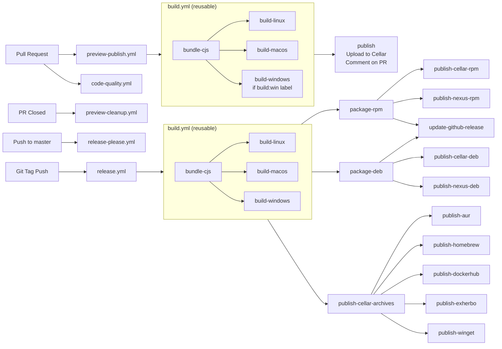

# Contributing to clever-tools

Welcome to the clever-tools project! We're happy you're interested in contributing. This guide will help you get started with development and explain our contribution process.

## Table of Contents

- [Requirements](#requirements)
- [Quick Start](#getting-started)
- [Development Workflow](#development-workflow)
- [Project Structure](#project-structure)
- [Development Standards](#development-standards)
- [Creating a New Command](#creating-a-new-command)
- [Documentation Generation](#documentation-generation)
- [Pull Request Process](#pull-request-process)
- [CI/CD & Release Process](#cicd--release-process)
- [Getting Help](#getting-help)

## Requirements

- Git
- Node.js 22 or higher (includes npm)
- System tools for local builds: `tar`, `zip` (usually pre-installed)
- A [Clever Cloud account](https://console.clever-cloud.com/users/me/information) (needed to test CLI commands)

## Getting Started

```bash
# 1. Fork and clone
git clone https://github.com/CleverCloud/clever-tools.git
cd clever-tools

# 2. Install and setup
npm install
git config core.hooksPath '.githooks'

# 3. Create development alias
echo "alias cleverr='node $(pwd)/bin/clever.js'" >> ~/.bashrc
source ~/.bashrc

# 4. Verify setup
cleverr version
```

## Development Workflow

### Before you start

**Always create an issue before starting work on a PR**, it helps us to:
- Avoid duplicate work
- Ensure the change aligns with project goals
- Discuss the feature/fix before implementation

### Branch Strategy

- **Main branch**: `master` (protected)
- **Feature branches**: Create from `master` with descriptive names

### Running and Debugging

- Run commands locally: `node bin/clever.js [command]` (or with the alias)
- Enable verbose mode: Add `-v` flag to any command for detailed output
- Use Node.js remote debugger for complex debugging scenarios

### Dependency Management

We maintain a conservative approach to dependencies:
- Only add dependencies when absolutely necessary
- Consider bundle size and maintenance burden
- Discuss new dependencies in your issue/PR

### API Integration

All communication with Clever Cloud's platform uses the [@clevercloud/client](https://www.npmjs.com/package/@clevercloud/client) library:
- Handles authentication and API requests
- Provides typed interfaces for all API endpoints
- Ensures consistent error handling across commands

### Development Scripts and Tools

We provide several utility scripts to streamline development (located in `/scripts`):

#### GitHub Actions Validation

- **`scripts/check-github-actions.js`**: Validates CI/CD configuration
  ```bash
  node scripts/check-github-actions.js
  ```

#### Preview Management

- **`scripts/preview.js`**: Build and manage PR preview versions
  ```bash
  # Build local preview
  scripts/preview.js build [branch-name]

  # List remote previews
  scripts/preview.js update
  ```

All scripts are written in TypeScript with JSDoc enforcement and include comprehensive usage examples.

## Project Structure

Understanding the codebase structure will help you navigate and contribute effectively:

```text
clever-tools/
├── bin/
│   └── clever.js                        # Main entry point for the CLI
├── src/
│   ├── commands/                        # All CLI commands are defined here
│   │   ├── <command>/                   # Each command gets its own directory
│   │   │   ├── <name>.args.js           # Argument definitions (shared between subcommands)
│   │   │   ├── <name>.command.js        # Root command (optional, for command groups)
│   │   │   └── <name>.<sub>.command.js  # Subcommand (optional)
│   │   └── global.args.js               # Common arguments used across multiple commands
│   │   └── global.options.js            # Common options used across multiple commands
│   │   └── global.commands.js           # Central registry of all commands
│   ├── lib/                             # Utility libraries (define-command, define-option, etc.)
│   ├── models/                          # Business logic and API interactions
│   ├── parsers.js                       # Zod schema transformers for arguments/options
│   └── ...                              # Core libraries and utilities
├── scripts/                             # Build and CI scripts (TypeScript with JSDoc enforced)
│   ├── lib/                             # Shared utilities for scripts
│   └── templates/                       # Templates for package managers (AUR, Homebrew, etc.)
└── ...
```

## Development Standards

### Code Quality

We use modern tooling to maintain code quality. These standards are automatically enforced on every pull request via our GitHub Actions workflow. The `npm run validate` command runs all checks:

- **ESLint**: Detects and reports code quality issues
- **Prettier**: Ensures consistent code formatting
- **TypeScript**: Type checking for the `scripts/` directory
- **Documentation**: Validates generated documentation is up to date

```bash
# Run all quality checks
npm run validate

# Try to auto-fix errors
npm run lint:fix && npm run format && npm run docs
```

#### ESLint

Our ESLint setup uses flat config with recommended rules for JavaScript, imports, and Node.js:

```bash
# Check for linting errors
npm run lint

# Auto-fix fixable issues
npm run lint:fix
```

#### Prettier

For consistent code formatting:

```bash
# Format all files
npm run format

# Check formatting without changing files
npm run format:check
```

#### TypeScript

Currently enforced only in the `scripts/` directory (will expand to `src/` in the future):

```bash
# Type check
npm run typecheck
```

We use TypeScript through JSDoc comments for type safety without transpilation.

#### Development Environment

The project supports multiple development approaches:
- **Local debugging**: Use Node.js remote debugger with `--inspect` flag
- **Script development**: All `/scripts` files support `--help` for usage information


### Commit Guidelines

We follow [Conventional Commits](https://www.conventionalcommits.org) for automated changelog generation.

#### Format

```
<type>(<scope>): <subject>

<body>

<footer>
```

#### Types

- `feat:` - New features (appears in changelog as "🚀 Features")
- `fix:` - Bug fixes (appears in changelog as "🐛 Bug Fixes")
- `perf:` - Performance improvements (appears in changelog as "💪 Performance")
- `docs:` - Documentation changes
- `style:` - Code style changes (formatting, missing semicolons, etc.)
- `refactor:` - Code changes that neither fix bugs nor add features
- `test:` - Test additions or changes
- `chore:` - Maintenance tasks
- `build:` - Build system changes
- `ci:` - CI/CD changes

#### Scope

The scope should be the command name affected (e.g., `feat(env): add JSON output format`).

For changes affecting multiple commands:
- Split into multiple commits when possible
- Omit scope and explain in the commit body
- Use [release-please's multi-fix syntax](https://github.com/googleapis/release-please#what-if-my-pr-contains-multiple-fixes-or-features) for complex cases

#### Important Notes

- Only `feat`, `fix`, and `perf` commits appear in the changelog
- Git hooks will validate your commit format
- Invalid formats won't generate changelog entries

## Creating a New Command

All CLI commands are built with a consistent system using `defineCommand`, `defineOption`, and `defineArgument`. This section explains how to add a new command.

### Quick Example

Here's a minimal command that sets an environment variable:

```javascript
// src/commands/demo/demo.set.command.js
import { z } from 'zod';
import { defineCommand } from '../../lib/define-command.js';
import { Logger } from '../../logger.js';
import { demoNameArg, demoValueArg } from './demo.args.js';
import { appIdOrNameOption } from '../global.options.js';

export const demoSetCommand = defineCommand({
  description: 'Set a demo variable',
  since: '1.0.0',
  options: {
    app: appIdOrNameOption,
  },
  args: [demoNameArg, demoValueArg],
  async handler(options, name, value) {
    const { app } = options;
    // Your command logic here
    Logger.println(`Set ${name} = ${value}`);
  },
});
```

```javascript
// src/commands/demo/demo.args.js
import { z } from 'zod';
import { defineArgument } from '../../lib/define-argument.js';

export const demoNameArg = defineArgument({
  schema: z.string(),
  description: 'Name of the variable',
  placeholder: 'variable-name',
});

export const demoValueArg = defineArgument({
  schema: z.string(),
  description: 'Value of the variable',
  placeholder: 'variable-value',
});
```

### File Organization

1. **Create a new directory** for your command in `src/commands/<command-name>/`
2. **Define arguments** in `<command-name>.args.js` (if needed)
3. **Implement commands** as `<command-name>.command.js` or `<command-name>.<subcommand>.command.js`
4. **Register** the command in `src/commands/global.commands.js`

### Command Structure

Every command uses `defineCommand` with these properties:

```javascript
export const myCommand = defineCommand({
  // Human-readable description shown in help text
  description: 'What this command does',

  // Version when this command was first added
  since: '0.5.0',

  // Options (named parameters with -- prefix)
  options: {
    optionName: defineOption({ /* ... */ }),
  },

  // Arguments (positional parameters)
  args: [myArg1, myArg2],

  // Main command logic (async or sync)
  async handler(options, arg1, arg2) {
    // options contains parsed option values
    // arg1, arg2 are positional arguments
  },
});
```

### Defining Options

Options are named parameters prefixed with `--` (e.g., `--app my-app`). Define them with `defineOption`:

```javascript
export const myOption = defineOption({
  // The option name (used as --myOption or --my-option)
  name: 'my-option',

  // Zod schema for validation and transformation
  schema: z.string().optional(),

  // Description shown in help
  description: 'What this option does',

  // Short aliases (single letter, used as -a)
  aliases: ['m'],

  // Placeholder text shown in help for required values
  placeholder: 'value',

  // Optional: function to provide autocomplete suggestions
  complete: async () => ['option1', 'option2'],

  // Optional: mark as deprecated
  deprecated: 'use --new-option instead',
});
```

Reuse common options from `src/commands/global.options.js` instead of creating duplicates:

```javascript
import { appIdOrNameOption, aliasOption, humanJsonOutputFormatOption } from '../global.options.js';

export const myCommand = defineCommand({
  options: {
    app: appIdOrNameOption,      // Reuse existing option
    alias: aliasOption,
    format: humanJsonOutputFormatOption,
  },
  // ...
});
```

### Defining Arguments

Arguments are positional parameters without prefix (e.g., `clever deploy myfile.tar.gz`). Define them with `defineArgument`:

```javascript
export const myArg = defineArgument({
  // Zod schema for validation and transformation
  schema: z.string().transform((v) => parseInt(v, 10)),

  // Description shown in help
  description: 'What this argument represents',

  // Placeholder text shown in help
  placeholder: 'arg-name',
});
```

Reuse arguments from `src/commands/global.args.js` or your command's `.args.js` file.

### Schema Validation with Zod

Both options and arguments use [Zod](https://zod.dev) for validation and transformation:

```javascript
// Simple validation
schema: z.string().min(3).max(50)

// Optional with default
schema: z.string().optional()
schema: z.boolean().default(false)

// Enum validation
schema: z.enum(['dev', 'prod', 'staging']).default('dev')

// With transformation
schema: z.string().transform((v) => v.toLowerCase())
schema: z.string().transform(appIdOrName)  // Custom parser function

// Multiple values (comma-separated)
schema: z.string().transform((v) => v.split(','))
```

### Registering Your Command

Add your command to `src/commands/global.commands.js`:

```javascript
import { myCommand } from './my-command/my-command.command.js';
import { mySubCommand } from './my-command/my-command.sub.command.js';

export const commands = [
  // ... existing commands
  myCommand,
  mySubCommand,
];
```

### Command Groups

For related commands, create a hierarchy. For example, `addon create`, `addon list`, `addon delete`:

```javascript
// src/commands/addon/addon.command.js
export const addonCommand = defineCommand({
  description: 'Manage add-ons',
  since: '0.2.0',
  options: {},
  args: [],
  handler: null,  // No handler = command group
});

// src/commands/addon/addon.create.command.js
export const addonCreateCommand = defineCommand({
  description: 'Create an add-on',
  since: '0.2.3',
  options: { /* ... */ },
  args: [addonProviderArg, addonNameArg],
  async handler(options, provider, name) {
    // Implementation
  },
});
```

Both are registered in `global.commands.js` like this:

```js
export const globalCommands = {
  addon: [
    addonCommand,
    {
      create: addonCreateCommand,
      delete: addonDeleteCommand,
    },
  ],
};
```

### Testing Your Command

```bash
# Test with the dev alias
cleverr my-command --help
cleverr my-command arg1 --option value

# Reload from source (no build needed)
node bin/clever.js my-command arg1 --option value

# Check argument/option validation
node bin/clever.js my-command                       # Should error on missing required arg
node bin/clever.js my-command arg --format invalid  # Schema validation error
```

### Best Practices

- **Reuse options and arguments** from `global.options.js` and `global.args.js`
- **Keep options simple** - complex logic belongs in the handler or models
- **Validate early** - let Zod schemas catch errors before your handler runs
- **Use existing patterns** - check similar commands for naming and structure conventions
- **Document well** - descriptions appear in `--help` and automated documentation
- **Use Logger** for output - never use `console.log` directly
- **Handle errors gracefully** - throw descriptive Error objects from your handler
- **Support JSON output** - add a `format` option for machine-readable output when useful

### Example: Complete Command with Subcommands

See `src/commands/addon/` for a full example of a command group with multiple subcommands, options, and validation.

## Documentation Generation

The CLI documentation is automatically generated from your command definitions. Every time you modify a command's description, options, or arguments, the documentation updates accordingly.

### What Gets Generated

The documentation system maintains three types of documentation:

1. **Command Reference** (`src/commands/<command>/<command>.docs.md`)
   - Lists all commands and subcommands with their descriptions
   - Auto-generates **Arguments** table from your `defineArgument` definitions
   - Auto-generates **Options** table from your `defineOption` definitions
   - Preserves any custom H3 sections you add (examples, notes, etc.)

2. **Command README** (`src/commands/README.md`)
   - Central index of all available commands
   - Auto-generated table linking to each command's documentation
   - Maintained by the generator

3. **LLM Documentation** (`docs/llms-documentation.md`)
   - Optimized documentation for language models
   - Includes setup guides, available runtimes, add-ons, and zones
   - Auto-generated from API data + command definitions

### What's Auto-Generated vs. What You Can Edit

**Generated automatically (don't edit directly):**
- Arguments table (under `### 📥 Arguments`)
- Options table (under `### ⚙️ Options`)
- Command list and index
- `Since` version badges

**You can edit and customize:**
- Custom H3 sections (examples, troubleshooting, related commands, etc.)
- Any content after the Options section until the next H2 heading
- Keep your additions as H3 subheadings under the command's H2 heading

Example structure that works with regeneration:

```markdown
## ➡️ `clever my-command` <kbd>Since 1.0.0</kbd>

Description here

```bash
clever my-command arg1 [options]
```

### 📥 Arguments
[AUTO-GENERATED]

### ⚙️ Options
[AUTO-GENERATED]

### Examples

Your custom examples here (preserved on regeneration)

### See Also

Other related commands (preserved on regeneration)
```

### Regenerating Documentation

When you add or modify commands, the documentation files may become outdated. Regenerate them with:

```bash
# Regenerate all documentation
npm run docs

# Check if documentation is up-to-date without modifying files
npm run docs:check
```

**After modifying a command:**

1. Update your command definition (description, options, arguments)
2. Run `npm run docs` to regenerate the documentation
3. Add any custom sections or examples you want
4. Commit both the command file and the generated `.docs.md` file

**Important:** Always run `npm run docs` before committing changes to commands. The CI will fail validation if documentation is out-of-date with your command definitions.

### Validation

Documentation generation is part of the code quality checks:

```bash
# Full validation (includes documentation check)
npm run validate

# Auto-fix documentation if outdated
npm run lint:fix && npm run format && npm run docs
```

Your PR will fail validation if:
- Documentation files are out-of-date with command definitions
- Generated content doesn't match the actual commands

### Example Workflow

When you create a new command with options and arguments, here's what happens:

1. **You define** the command in `src/commands/mycommand/mycommand.command.js`:
   ```javascript
   defineCommand({
     description: 'Do something useful',
     options: {
       verbose: defineOption({
         name: 'verbose',
         description: 'Show detailed output',
         aliases: ['v'],
       }),
     },
     args: [myArg],
   })
   ```

2. **You regenerate** with `npm run docs`

3. **The generator creates** `src/commands/mycommand/mycommand.docs.md` with:
   - Command description
   - Usage syntax
   - Arguments table (from `myArg` definition)
   - Options table (from `verbose` option)

4. **You can add** custom H3 sections with examples, notes, or related information

5. **Next time you run** `npm run docs`, the Arguments/Options tables update automatically, but your custom sections remain unchanged

This keeps documentation always in sync with the actual command behavior while allowing you to add helpful context and examples.

## Pull Request Process

### 1. Before Creating a PR

- Test your changes thoroughly
- Ensure an issue exists for your change
- Ensure your branch is rebased on the latest `master` and contains no fixup/squash commits
- Run all quality checks locally with `npm run validate` (it will also be run automatically on your PR)

### 2. Creating Your PR

- Provide clear description of changes
- Mark as draft if work is in progress
- Reference the issue in your PR description
- Include testing instructions if applicable

### 3. Preview Builds

Every PR automatically gets preview builds for testing:

- **Automatic**: Linux and macOS builds for all PRs (except docs-only changes)
- **Windows**: Add the `build:win` label to include Windows builds
- **Download links**: Posted as comments on your PR
- **Cleanup**: Preview builds are removed when PR is closed

### Local Preview Management

You can manage preview builds locally using the `scripts/preview.js` script:

```bash
# Build a preview and install it locally
scripts/preview.js build [branch-name]

# Publish a built preview to remote storage
scripts/preview.js publish [branch-name]

# List and update remote previews (with filtering support)
scripts/preview.js update [filter]

# Delete a preview from remote storage and locally
scripts/preview.js delete [branch-name]

# Generate PR comment with download links
scripts/preview.js pr-comment [branch-name]
```

The script provides terminal-based preview listing and management with download progress reporting. For publish/delete operations, you'll need admin Cellar credentials:

```bash
export CC_CLEVER_TOOLS_PREVIEWS_CELLAR_BUCKET="your-bucket"
export CC_CLEVER_TOOLS_PREVIEWS_CELLAR_KEY_ID="your-key-id"
export CC_CLEVER_TOOLS_PREVIEWS_CELLAR_SECRET_KEY="your-secret-key"
```

### 4. Review Process

- PRs are reviewed by the Clever Cloud team
- Keep your branch up to date with `master`
- Be patient - we aim for thorough reviews

## CI/CD & Release Process

### Overview

Our CI/CD pipeline ensures quality and automates releases:

1. **Pull Requests** → Code quality validation and preview builds for testing
2. **Merge to master** → Release-please creates/updates release PR
3. **Release PR merged** → Automated release to all distribution channels

### Simplified Workflow

- Code quality validation on every PR (commit format, linting, formatting, type checking)
- Preview builds on every PR
- Conventional commits drive changelog generation
- Release-please manages versioning
- Automated publishing to multiple platforms:
  - **AUR**: Arch Linux User Repository
  - **Cellar**: Clever Cloud's object storage for direct downloads
  - **Docker Hub**: Official Docker images
  - **Exherbo**: Linux distribution packages
  - **Homebrew**: macOS package manager
  - **GitHub Releases**: Binary archives and release notes
  - **Nexus**: RPM and DEB packages for Linux distributions
  - **npm**: Published on npmjs.org
  - **WinGet**: Windows Package Manager

Key workflows:
- **code-quality.yml** - Validates commit format, code standards, and branch status on PRs
- **build.yml** - Reusable workflow creating cross-platform binaries using @yao-pkg/pkg
- **preview-publish.yml** - Builds and publishes PR previews
- **release-please.yml** - Manages release PRs
- **release.yml** - Publishes to all distribution channels



### Build System

The build process creates self-contained binaries for all platforms using modern tooling:
- **Bundling**: Rollup creates a single CommonJS file from the ESM source
- **Compilation**: @yao-pkg/pkg (successor to vercel/pkg) compiles binaries for Linux, macOS, and Windows
- **Packaging**: Node.js scripts generate platform-specific archives (.tar.gz, .zip) and packages (.deb, .rpm)
- **Distribution**: Automated publishing to 10+ channels including npm, Homebrew, Docker Hub, and Linux repositories

### Script-Based Architecture

Most CI/CD operations use Node.js scripts in `/scripts`:
- Consistent patterns and error handling
- Testable locally
- Self-documenting with usage examples
- Reusable across workflows

## Getting Help

- **GitHub Issues**: For general discussions, bugs, features, and questions about clever-tools
- **PR Comments**: For specific feedback on your changes
- **Clever Cloud Support**: For platform-related questions

We appreciate your contributions and look forward to working with you!
