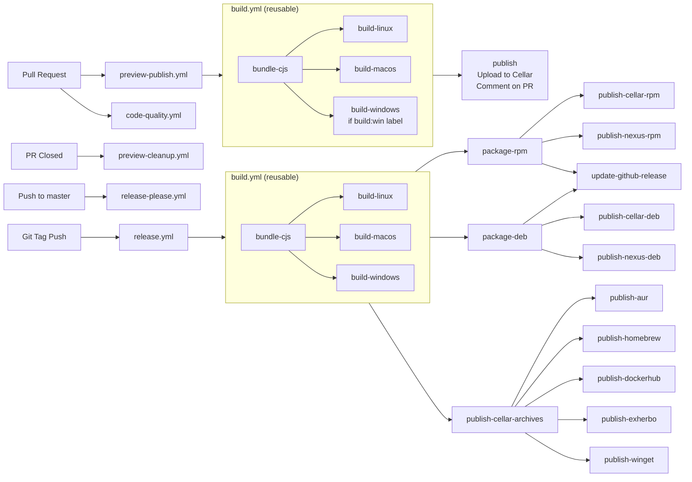

# Contributing to clever-tools

Welcome to the clever-tools project! We're happy you're interested in contributing. This guide will help you get started with development and explain our contribution process.

## Table of Contents

- [Requirements](#requirements)
- [Quick Start](#getting-started)
- [Development Workflow](#development-workflow)
- [Project Structure](#project-structure)
- [Development Standards](#development-standards)
- [Pull Request Process](#pull-request-process)
- [CI/CD & Release Process](#cicd--release-process)
- [Getting Help](#getting-help)

## Requirements

- Git
- Node.js 22 or higher (includes npm)
- System tools for local builds: `tar`, `zip` (usually pre-installed)
- A [Clever Cloud account](https://console.clever-cloud.com/users/me/information) (needed to test CLI commands)

## Getting Started

```bash
# 1. Fork and clone
git clone https://github.com/CleverCloud/clever-tools.git
cd clever-tools

# 2. Install and setup
npm install
git config core.hooksPath '.githooks'

# 3. Create development alias
echo "alias cleverr='node $(pwd)/bin/clever.js'" >> ~/.bashrc
source ~/.bashrc

# 4. Verify setup
cleverr version
```

## Development Workflow

### Before you start

**Always create an issue before starting work on a PR**, it helps us to:
- Avoid duplicate work
- Ensure the change aligns with project goals
- Discuss the feature/fix before implementation

### Branch Strategy

- **Main branch**: `master` (protected)
- **Feature branches**: Create from `master` with descriptive names

### Running and Debugging

- Run commands locally: `node bin/clever.js [command]` (or with the alias)
- Enable verbose mode: Add `-v` flag to any command for detailed output
- Use Node.js remote debugger for complex debugging scenarios

### Dependency Management

We maintain a conservative approach to dependencies:
- Only add dependencies when absolutely necessary
- Consider bundle size and maintenance burden
- Discuss new dependencies in your issue/PR

### API Integration

All communication with Clever Cloud's platform uses the [@clevercloud/client](https://www.npmjs.com/package/@clevercloud/client) library:
- Handles authentication and API requests
- Provides typed interfaces for all API endpoints
- Ensures consistent error handling across commands

### Development Scripts and Tools

We provide several utility scripts to streamline development (located in `/scripts`):

#### Profile Management
- **`scripts/switch-profile.js`**: Interactive tool for managing multiple Clever Cloud accounts
  ```bash
  # Interactive profile selection
  node scripts/switch-profile.js
  
  # Direct profile switching
  node scripts/switch-profile.js --profile "user@example.com"
  ```

#### GitHub Actions Validation  
- **`scripts/check-github-actions.js`**: Validates CI/CD configuration
  ```bash
  node scripts/check-github-actions.js
  ```

#### Preview Management
- **`scripts/preview.js`**: Build and manage PR preview versions
  ```bash
  # Build local preview
  scripts/preview.js build [branch-name]
  
  # List remote previews
  scripts/preview.js update
  ```

All scripts are written in TypeScript with JSDoc enforcement and include comprehensive usage examples.

## Project Structure

Understanding the codebase structure will help you navigate and contribute effectively:

```text
clever-tools/
├── bin/
│   └── clever.js            # Main entry point for the CLI
├── src/
│   ├── commands/            # All CLI commands are defined here
│   ├── lib/                 # Additional utility libraries
│   ├── models/              # Business logic and API interactions (a bit of a mixed bag)
│   └── ...                  # Core libraries and utilities
├── scripts/                 # Build and CI scripts (TypeScript with JSDoc enforced)
│   ├── lib/                 # Shared utilities for scripts
│   └── templates/           # Templates for package managers (AUR, Homebrew, etc.)
└── ...
```

## Development Standards

### Code Quality

We use modern tooling to maintain code quality. These standards are automatically enforced on every pull request via our GitHub Actions workflow:

#### ESLint

Our ESLint setup uses flat config with recommended rules for JavaScript, imports, and Node.js:

```bash
# Check for linting errors
npm run lint

# Auto-fix fixable issues
npm run lint:fix

# Run all quality checks and try to auto-fix them
npm run validate
npm run fix-all
```

#### Prettier

For consistent code formatting:

```bash
# Format all files
npm run format

# Check formatting without changing files
npm run format:check
```

#### TypeScript

Currently enforced only in the `scripts/` directory (will expand to `src/` in the future):

```bash
# Type check
npm run typecheck
```

We use TypeScript through JSDoc comments for type safety without transpilation.

#### Development Environment

The project supports multiple development approaches:
- **Local debugging**: Use Node.js remote debugger with `--inspect` flag
- **Script development**: All `/scripts` files support `--help` for usage information
- **Profile switching**: Use the profile utility for testing with different Clever Cloud accounts

### Commit Guidelines

We follow [Conventional Commits](https://www.conventionalcommits.org) for automated changelog generation.

#### Format

```
<type>(<scope>): <subject>

<body>

<footer>
```

#### Types

- `feat:` - New features (appears in changelog as "🚀 Features")
- `fix:` - Bug fixes (appears in changelog as "🐛 Bug Fixes")
- `perf:` - Performance improvements (appears in changelog as "💪 Performance")
- `docs:` - Documentation changes
- `style:` - Code style changes (formatting, missing semicolons, etc.)
- `refactor:` - Code changes that neither fix bugs nor add features
- `test:` - Test additions or changes
- `chore:` - Maintenance tasks
- `build:` - Build system changes
- `ci:` - CI/CD changes

#### Scope

The scope should be the command name affected (e.g., `feat(env): add JSON output format`).

For changes affecting multiple commands:
- Split into multiple commits when possible
- Omit scope and explain in the commit body
- Use [release-please's multi-fix syntax](https://github.com/googleapis/release-please#what-if-my-pr-contains-multiple-fixes-or-features) for complex cases

#### Important Notes

- Only `feat`, `fix`, and `perf` commits appear in the changelog
- Git hooks will validate your commit format
- Invalid formats won't generate changelog entries

## Pull Request Process

### 1. Before Creating a PR

- Test your changes thoroughly
- Ensure an issue exists for your change
- Ensure your branch is rebased on the latest `master` and contains no fixup/squash commits
- Run all quality checks locally with `npm run validate` (it will also be run automatically on your PR)

### 2. Creating Your PR

- Provide clear description of changes
- Mark as draft if work is in progress
- Reference the issue in your PR description
- Include testing instructions if applicable

### 3. Preview Builds

Every PR automatically gets preview builds for testing:

- **Automatic**: Linux and macOS builds for all PRs (except docs-only changes)
- **Windows**: Add the `build:win` label to include Windows builds
- **Download links**: Posted as comments on your PR
- **Cleanup**: Preview builds are removed when PR is closed

### Local Preview Management

You can manage preview builds locally using the `scripts/preview.js` script:

```bash
# Build a preview and install it locally
scripts/preview.js build [branch-name]

# Publish a built preview to remote storage
scripts/preview.js publish [branch-name]

# List and update remote previews (with filtering support)
scripts/preview.js update [filter]

# Delete a preview from remote storage and locally
scripts/preview.js delete [branch-name]

# Generate PR comment with download links
scripts/preview.js pr-comment [branch-name]
```

The script provides terminal-based preview listing and management with download progress reporting. For publish/delete operations, you'll need admin Cellar credentials:

```bash
export CC_CLEVER_TOOLS_PREVIEWS_CELLAR_BUCKET="your-bucket"
export CC_CLEVER_TOOLS_PREVIEWS_CELLAR_KEY_ID="your-key-id"
export CC_CLEVER_TOOLS_PREVIEWS_CELLAR_SECRET_KEY="your-secret-key"
```

### 4. Review Process

- PRs are reviewed by the Clever Cloud team
- Keep your branch up to date with `master`
- Be patient - we aim for thorough reviews

## CI/CD & Release Process

### Overview

Our CI/CD pipeline ensures quality and automates releases:

1. **Pull Requests** → Code quality validation and preview builds for testing
2. **Merge to master** → Release-please creates/updates release PR
3. **Release PR merged** → Automated release to all distribution channels

### Simplified Workflow

- Code quality validation on every PR (commit format, linting, formatting, type checking)
- Preview builds on every PR
- Conventional commits drive changelog generation
- Release-please manages versioning
- Automated publishing to multiple platforms:
  - **AUR**: Arch Linux User Repository
  - **Cellar**: Clever Cloud's object storage for direct downloads
  - **Docker Hub**: Official Docker images
  - **Exherbo**: Linux distribution packages
  - **Homebrew**: macOS package manager
  - **GitHub Releases**: Binary archives and release notes
  - **Nexus**: RPM and DEB packages for Linux distributions
  - **npm**: Published on npmjs.org
  - **WinGet**: Windows Package Manager

Key workflows:
- **code-quality.yml** - Validates commit format, code standards, and branch status on PRs
- **build.yml** - Reusable workflow creating cross-platform binaries using @yao-pkg/pkg
- **preview-publish.yml** - Builds and publishes PR previews
- **release-please.yml** - Manages release PRs
- **release.yml** - Publishes to all distribution channels



### Build System

The build process creates self-contained binaries for all platforms using modern tooling:
- **Bundling**: Rollup creates a single CommonJS file from the ESM source
- **Compilation**: @yao-pkg/pkg (successor to vercel/pkg) compiles binaries for Linux, macOS, and Windows
- **Packaging**: Node.js scripts generate platform-specific archives (.tar.gz, .zip) and packages (.deb, .rpm)
- **Distribution**: Automated publishing to 10+ channels including npm, Homebrew, Docker Hub, and Linux repositories

### Script-Based Architecture

Most CI/CD operations use Node.js scripts in `/scripts`:
- Consistent patterns and error handling
- Testable locally
- Self-documenting with usage examples
- Reusable across workflows

## Getting Help

- **GitHub Issues**: For general discussions, bugs, features, and questions about clever-tools
- **PR Comments**: For specific feedback on your changes
- **Clever Cloud Support**: For platform-related questions

We appreciate your contributions and look forward to working with you!
